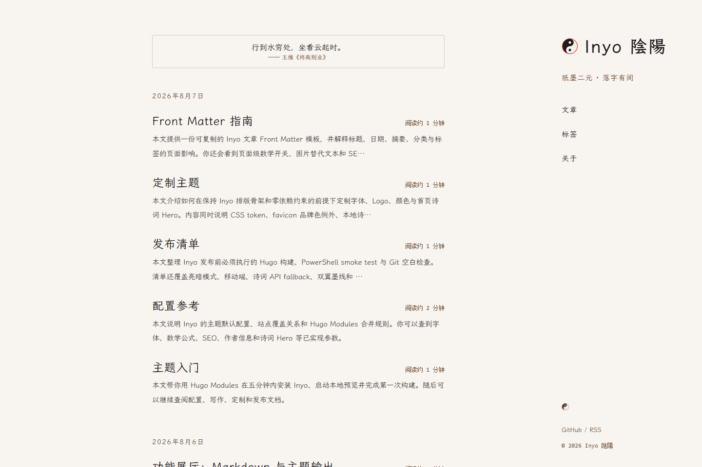

# Inyo 陰陽

> 纸墨二元 · 日式现代简约 × 古中国水墨 — Hugo 博客主题

**Inyo（陰陽）** 是一个为长文阅读设计的 Hugo 博客主题。亮色模式是墨在纸上（荼蘼白宣纸底 + 墨色正文），暗色模式是白墨在墨（墨色夜墨底 + 月白正文）。朱砂红是唯一的情绪色——像一枚印章盖在整个站点上。



发布基线：**v0.1.0**（最新补丁 **v0.1.1**）· Hugo Extended `>= 0.164.0` · Go `>= 1.26.1`（Hugo Modules）

## 快速开始

```bash
hugo mod init example.org/my-site
hugo mod get github.com/FeiNiaoBF/hugo-theme-inyo
hugo mod tidy
hugo server
```

## 特性

- 🌗 **纸墨双模式**：亮 = 荼蘼白宣纸，暗 = 墨色夜墨；颜色全部出自《中华传统色》742 库、WCAG AA 实测
- 🖌️ **诗句 Hero**：首页诗句 + 作者出处；点击后**两阶段**反馈——朱红双翼墨线先从底部中央沿圆角边框上行、在**顶部中央**合墨，再落字；本地数据兜底、远程 API 可选
- 🔖 **太极 Logo**：双鱼太极 + 朱砂环，几何验证面积对称；网页内联版随主题 token 变色
- 🧭 **可移植导航**：文章入口读 `mainSections[0]`，标签/About 路径可配置——换 section 不用改模板
- 📖 **长文优先**：40em 阅读列、行高 2.0、霞鹜文楷自托管分片（零 CDN、支持子路径部署）
- 🔍 **SEO 全家桶**：canonical / OpenGraph / Twitter Card / Person + BreadcrumbList JSON-LD / description 三级回退
- ♿ **可访问性 WCAG AA**：skip link、全局焦点环、`prefers-reduced-motion`、ARIA 状态、`aria-current`
- 🧮 **页级数学**：KaTeX 开关支持站点默认 + 单篇 `math: true` 按页启用
- 🔤 **多语言**：zh-cn / en / ja + 语言切换器
- ⚡ **性能**：图片懒加载（LCP 首图保护）、首页脚本按页输出、字体防 FOUC、合成器属性动效

## 安装

### Hugo Modules（推荐）

```toml
# hugo.toml
[module]
[[module.imports]]
path = "github.com/FeiNiaoBF/hugo-theme-inyo"
```

```bash
hugo mod tidy
```

本地开发用 `replace` 指向本地路径：

```toml
[module]
replacements = "github.com/FeiNiaoBF/hugo-theme-inyo -> ../hugo-theme-inyo"

[[module.imports]]
path = "github.com/FeiNiaoBF/hugo-theme-inyo"
```

### 经典 themes/ 目录

```bash
git clone https://github.com/FeiNiaoBF/hugo-theme-inyo.git themes/inyo
```

```toml
theme = "inyo"
```

## 配置

主题默认值在 `config/_default/params.toml` 与 `markup.toml`（Hugo Modules 深合并，站点配置优先）。只写偏离默认值的部分：

```toml
[params]
description = "一个使用 Inyo 构建的长文博客。"   # 站点 SEO 描述（无页级描述时兜底）
font = "wenkai"                    # wenkai（霞鹜文楷，默认，自托管）| serif（思源宋体，CDN）
math = false                       # 全站 KaTeX；单篇可 front matter math: true 按页开启
mainSections = ["posts"]           # 首页目录与文章导航使用的 section
subtitle = "纸墨二元 · 落字有间"
author = "Inyo"                    # SEO Person schema + 文章作者
# ogImage = "img/your-og.png"      # 社交分享图；默认 img/seal-yang-og.png（PNG）

[params.navigation]
tags = "tags"                      # 标签 taxonomy 路径
about = "about"                    # About 页面路径

[params.heroPoetry.api]
enabled = false                    # 远程诗句，默认关闭；失败静默回退本地
endpoint = "https://poetry.palemoky.com/api/poems/random"
lang = "zh-Hans"

[[params.social]]
name = "GitHub"
url = "https://github.com/FeiNiaoBF/hugo-theme-inyo"

[[params.social]]
name = "RSS"
url = "/index.xml"
```

要点：

- 文章导航与 404 返回链接读 `mainSections[0]`；标签链接读 `params.navigation.tags`——section 和 taxonomy 可自由改名
- 远程诗词 API 最小合同：对象本身或 `data` 包装含 `content`（数组取首条非空）、`author`、`title`；不符即静默回退 `data/inyo/hero_poems.toml`
- 若站点自定义 `[markup]`（如 Goldmark `unsafe`），必须保留 `_merge = "deep"`，主题的 class-based Chroma 才会生效
- 完整参数表见演示站 [配置参考](/posts/configuration-reference/)；更多定制见 [定制主题](/posts/customization/)

## 多语言

内置 zh-cn / en / ja 翻译；站点配置多个 `[languages.*]` 后，右侧栏自动显示语言切换器。

## 目录结构

```
hugo-theme-inyo/
├── DESIGN.md        # 设计文档（配色 token 权威来源 + ADR + 动效规范）
├── theme.toml       # Hugo Themes 分发元数据
├── archetypes/      # hugo new content 默认 Front Matter
├── images/          # 主题市场截图与缩略图
├── config/_default/ # 可合并的默认参数与 Markdown 配置
├── layouts/         # 模板 + partials + _markup 渲染 hooks
├── assets/css/      # main.css（token 体系）+ wenkai.css（自托管字体分片）
├── data/inyo/       # Hero 诗句本地 fallback
├── scripts/         # verify-theme / verify-consumer smoke 门禁 + consumer fixture
├── .github/workflows/ # Windows Hugo 构建与双 smoke CI
├── static/img/      # favicon SVG 与社交分享 PNG
└── exampleSite/     # 演示站点（hugo server --source exampleSite）
```

## 验证

```bash
hugo --source exampleSite --minify
pwsh -File scripts/verify-theme.ps1      # 生成物 / SEO / a11y / i18n / token 合同
pwsh -File scripts/verify-consumer.ps1   # 独立消费者（notes section + labels taxonomy）可移植性
git diff --check
```

GitHub Actions 在每次 push / PR 上运行上述两组门禁（Windows runner、Go 1.26.1、Hugo Extended 0.164.0）。通过 CI 是发布前提。

## 质量门禁

- 网页内联 Logo 使用主题 token，亮暗自适应；`static/img/seal-yang.svg` 是 favicon 固定品牌色例外（无 CSS 变量上下文）
- 诗句 Hero 只输出在首页；远程 API 默认关闭、必有本地 fallback；`prefers-reduced-motion` 降级
- 文章列表优先 `.Summary`（支持 front matter `summary` / `<!--more-->` / 自动），为空才回退 `.Description`
- 新建内容：`hugo new content posts/my-first-post.md`（archetype 自动填标题/日期/摘要等）

## English

Inyo is a Chinese-first editorial Hugo theme for long-form reading: paper-and-ink dual themes, a homepage poetry interaction, multilingual UI (zh-cn/en/ja), taxonomy pages, page-level KaTeX, accessible navigation, and self-hosted LXGW WenKai fonts.

**Compatibility:** Inyo `v0.1.0` · Hugo Extended `>= 0.164.0` · Go `>= 1.26.1` (Modules)

**Install (Modules):**

```powershell
hugo mod init example.com/my-site
hugo mod get github.com/FeiNiaoBF/hugo-theme-inyo
```

```toml
[module]
[[module.imports]]
path = "github.com/FeiNiaoBF/hugo-theme-inyo"
```

Theme defaults live in `config/_default/`. Configure site identity, `params.description`, `mainSections`, navigation paths, author, and social links in your `hugo.toml`. The remote poetry API is disabled by default; local poems in `data/inyo/hero_poems.toml` are the fallback.

**Verify:**

```powershell
hugo --source exampleSite --minify
pwsh -File scripts/verify-theme.ps1
pwsh -File scripts/verify-consumer.ps1
```

New posts use the theme's TOML archetype. Released under the MIT License.

## 许可

MIT © FeiNiaoBF

---

配色与设计决策的完整记录见 [DESIGN.md](DESIGN.md)。
